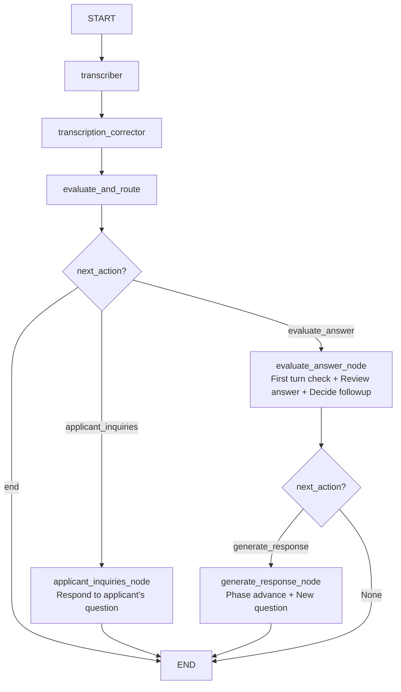

# Interview Workflow Diagram

## Graph Structure

## Node Descriptions

### evaluate_and_route
Determines the next action based on interview state:
- **end**: Returns completion message if `current_phase_index >= len(interview_phases) - 1` or if applicant indicates no more questions
- **applicant_inquiries**: Routes to applicant inquiries handler if in `applicant_inquiries` phase with questions already asked
- **evaluate_answer**: Routes to answer evaluation for normal phases (icebreaker, preliminary, technical, situational) AND first turn of applicant_inquiries

### evaluate_answer_node
Handles two scenarios:
1. **First turn of applicant_inquiries**: Returns opening message "That concludes my questions..." directly
2. **Answer evaluation**: Reviews the applicant's answer, returns followup question directly if needed, otherwise routes to `generate_response_node`

### applicant_inquiries_node
Responds to the applicant's questions about the company/role. Increments question counter and resets follow-up count.

### generate_response_node
Handles phase advancement and new question generation:
- Checks if max questions reached, advances phase
- If advanced to `applicant_inquiries`, returns first turn message
- Otherwise generates the next interview question for the current phase
